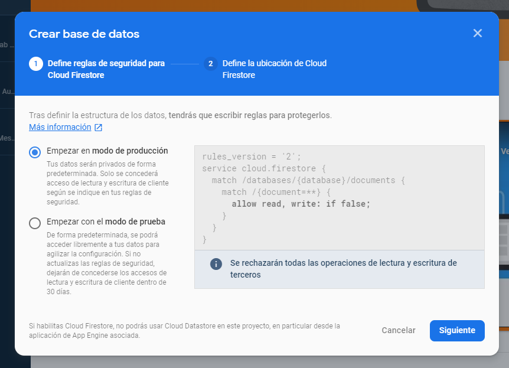
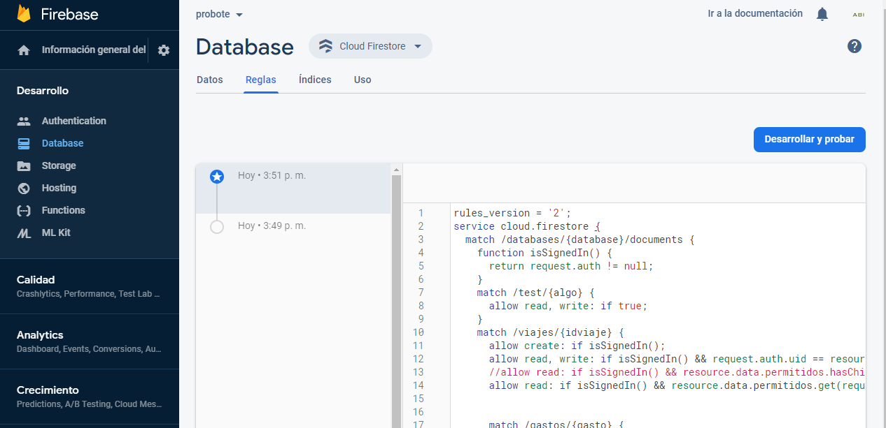
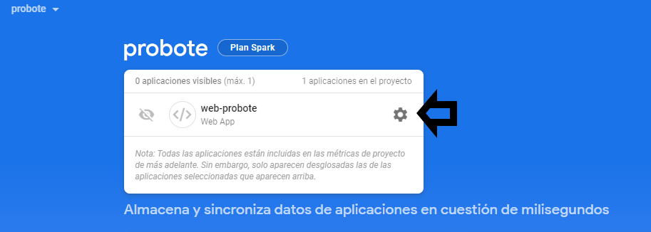

# Base de datos
En este documento se detalla el proceso necesario para crear y usar una base de datos propia en vez de la usada por defecto en este proyecto.

## Requisitos

Para poder efectuar esta tarea necesitaras las siguientes herramientas:
- Cuenta de Google
- Acceso a https://console.firebase.google.com/

### Crear Proyecto

Accede a https://console.firebase.google.com/ y crea un nuevo proyecto

Especificar un nombre al proyecto

Actualmente el proyecto no tiene soporte para Google Analytics. Por lo que no es necesario habilitarlo. Es posible habilitar analytics más adelante.

### Añadir aplicación web

Este proceso nos facilitara las credenciales necesarias para el proyecto.
Seleccionar la opción web, representada como `</>`

Especificar un nombre al proyecto y habilitar el hosting para realizar despliegues

Los siguientes pasos no son necesarios, pulsamos siguiente y volvemos a la consola.

### Métodos de autenticación

Necesitamos configurar los métodos de autenticación, para ello desde el menú `Desarrollo>Authentication>Configura el método de incio de sesión` 

Los métodos necesarios son `Correo electrónico/contraseña` y `Google`

### Cloud Firestore

Es necesario habilitar Cloud Firestore en el proyecto. Para ello pulsar el botón `Crear base de datos` en `Desarrollo/Database`

Seleccionar `modo de producción`

Seleccionar ubicación dee Cloud Firestore

#### Reglas

Es necesario determinar los permisos para la base de datos. Para ello desde el menu reglas, incluir las reglas del archivo
[firestore.rules](/firestore.rules)

### Credenciales

Una vez creada la aplicación web podemos acceder a las credenciales.
Para ello, desde la consola del proyecto pulsaremos en los ajustes de la aplicación web

Desde el menu de aplicaciones seleccionar el `Firebase SDK snippet` `Configuración`.

Modifica los valores de [environment.prod.ts](/src/environments/environment.prod.ts) y 
[environment.ts](/src/environments/environment.ts) con los facilitados por la consola de firebase.

### Generar web

Finalmente genera la web usando los pasos especificados en [web.md](web.md)

### Functions

Es posible que quieras habilitar Firebase Functions en el proyecto. Firebase Functions permite ejecutar código en los
servidores de firebase con una llamada HTTP. Actualmente el proyecto dispone de dos [functions](functions). Consulta la
documentación de [functions](documentacion/firebase.md)
