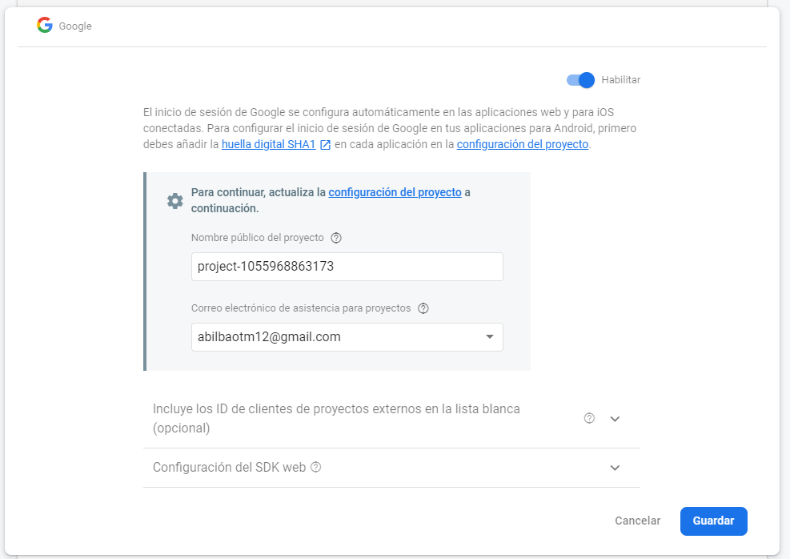
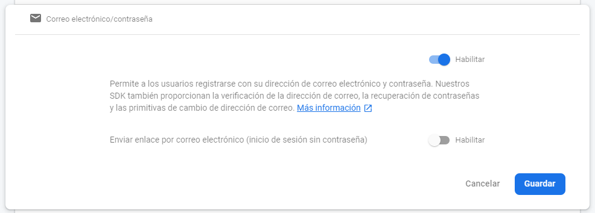

# Firebase
## Authentication

Necesitamos configurar los métodos de autenticación, para ello desde el menú `Desarrollo>Authentication>Configura el método de incio de sesión` 

Los métodos necesarios son `Correo electrónico/contraseña` y `Google`

---

[Inicio documentación](../README.md) - [>>Siguiente Documento >>](hosting.md)
