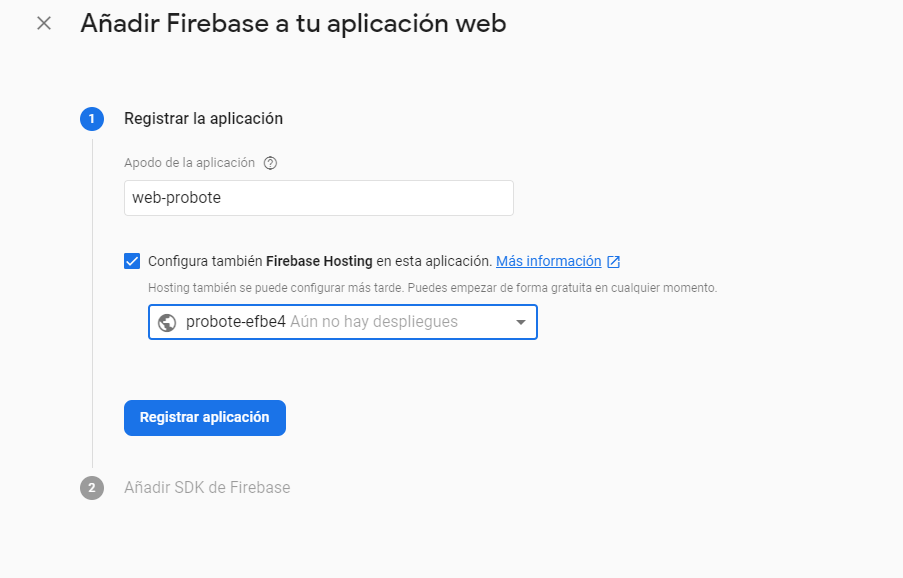

# Firebase
## Nuevo proyecto
En este documento se detalla el proceso necesario para crear y usar un proyecto en vez de la usada por defecto en este proyecto.

### Requisitos

Para poder efectuar esta tarea necesitaras las siguientes herramientas:
- Cuenta de Google
- Acceso a https://console.firebase.google.com/

#### Crear Proyecto

Accede a https://console.firebase.google.com/ y crea un nuevo proyecto

Especificar un nombre al proyecto

Actualmente el proyecto no tiene soporte para Google Analytics. Por lo que no es necesario habilitarlo. Es posible habilitar analytics más adelante.

### Añadir aplicación web

Este proceso nos facilitara las credenciales necesarias para el proyecto.
Seleccionar la opción web, representada como `</>`

Especificar un nombre al proyecto y habilitar el hosting para realizar despliegues

Los siguientes pasos no son necesarios, pulsamos siguiente y volvemos a la consola.

## Integración

Una vez creada la aplicación web podemos acceder a las credenciales.
Para ello, desde la consola del proyecto pulsaremos en los ajustes de la aplicación web

Desde el menu de aplicaciones seleccionar el `Firebase SDK snippet` `Configuración`.

Modifica los valores de [environment.prod.ts](/src/environments/environment.prod.ts) y 
[environment.ts](/src/environments/environment.ts) con los facilitados por la consola de firebase.

### Functions

Es posible que quieras habilitar Firebase Functions en el proyecto. 

---

[Inicio documentación](../README.md) - [>>Siguiente Documento >>](firestore.md)
