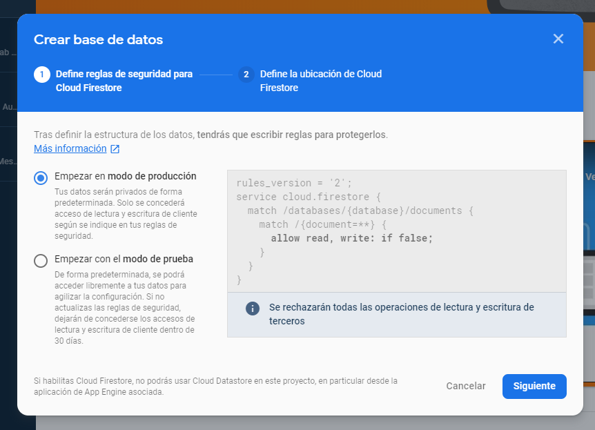
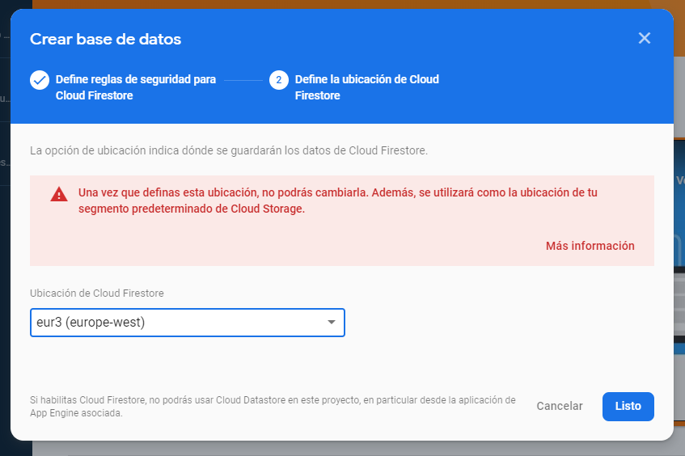
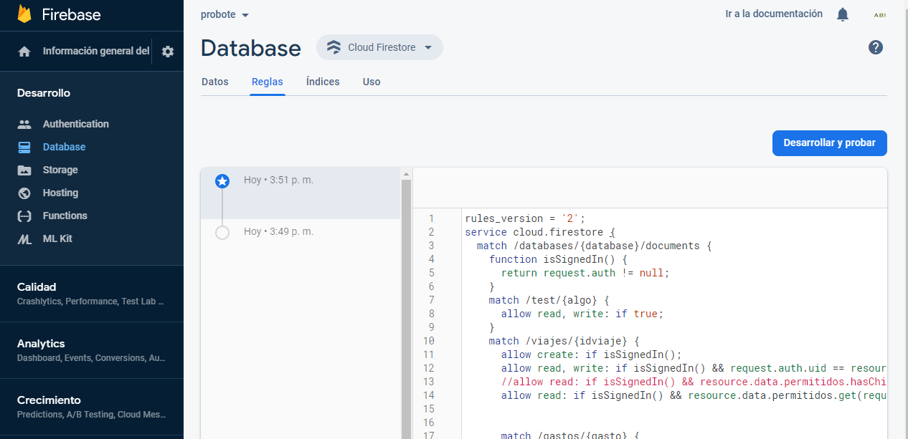

# Firebase
## Firestore

Es necesario habilitar Cloud Firestore en el proyecto. Para ello pulsar el botón `Crear base de datos` en `Desarrollo/Database`

Seleccionar `modo de producción`

Seleccionar ubicación dee Cloud Firestore

#### Reglas

Es necesario determinar los permisos para la base de datos. Para ello desde el menu reglas, incluir las reglas del archivo
[firestore.rules](/firestore.rules)

---

[Inicio documentación](../README.md) - [>>Siguiente Documento >>](authentication.md)
