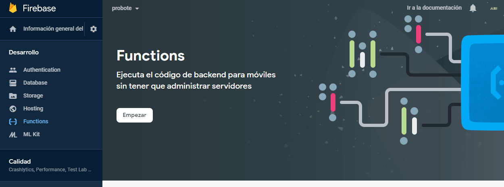
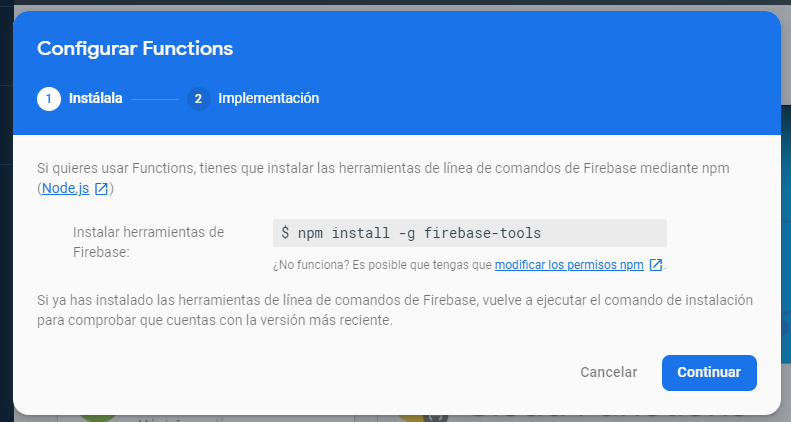
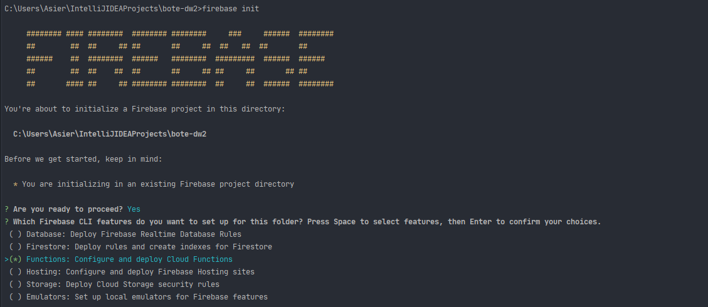
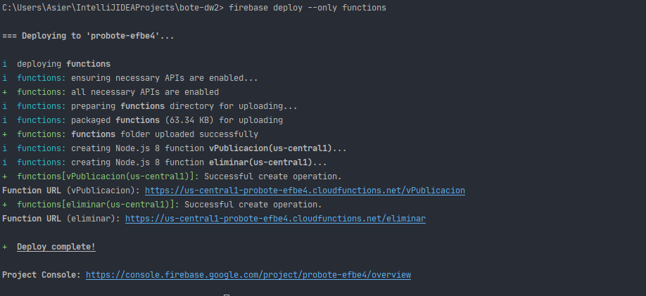
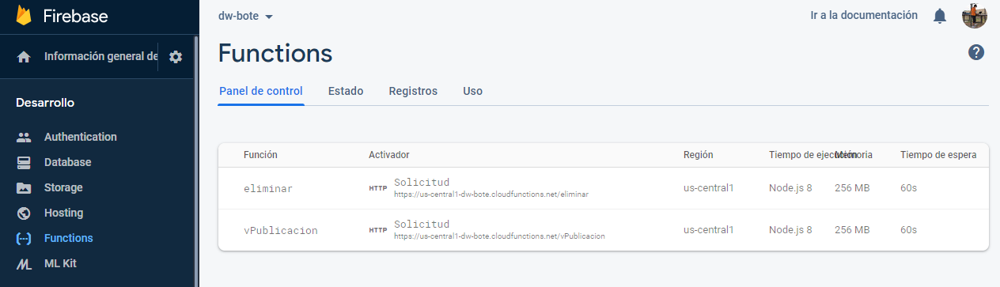
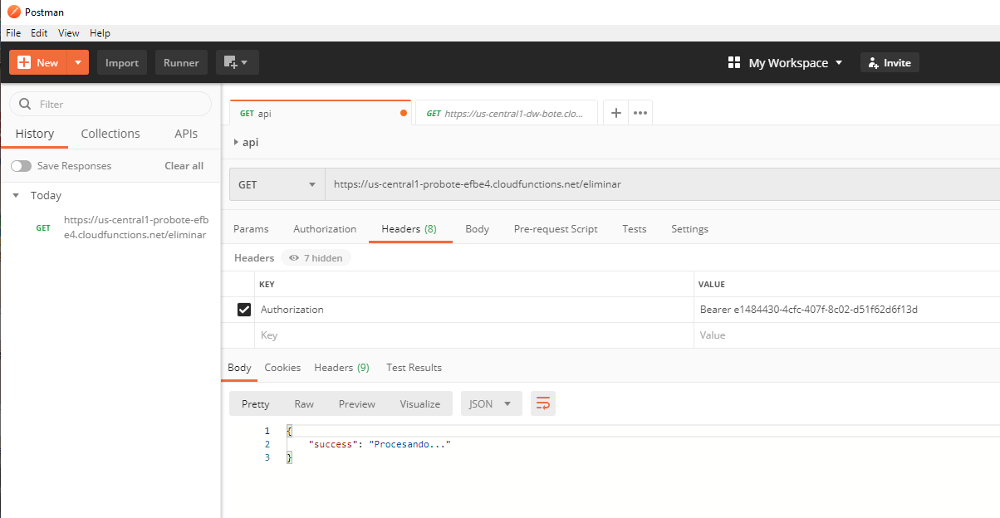

# Firebase 
## Functions

Firebase Functions permite ejecutar código en los
servidores de firebase con una llamada HTTP. Actualmente el proyecto dispone de dos [functions](#funciones-disponibles).

Para poder habilitar Firebase Functions accede a la consola
de Firebase


Sigue las instrucciones, necesitarás tener [Node.js](https://nodejs.org/en/) instalado en tu sistema y ejecutar el siguiente comando:
`npm install -g firebase-tools`



Situa la línea de comandos en la carpeta del proyecto y ejecuta los siguientes comandos:

Es posible que tengas que iniciar sesión con tu cuenta de google.


IMPORTANTE: Eliminar fichero [.firebaserc](/.firebaserc) para poder configurar el proyecto con un proyecto Firebase diferente

`firebase login` 

`firebase init` 

Usa las siguientes opciones durante el proceso de init. 



```
? Are you ready to proceed? Yes
? Which Firebase CLI features do you want to set up for this folder?  Functions: Configure and deploy Cloud Functions
? Please select an option: Use an existing project
? Select a default Firebase project for this directory: probote-efbe4 (probote)
? What language would you like to use to write Cloud Functions? JavaScript
? Do you want to use ESLint to catch probable bugs and enforce style? No
? File functions/package.json already exists. Overwrite? No
? File functions/index.js already exists. Overwrite? No
? File functions/.gitignore already exists. Overwrite? No
? Do you want to install dependencies with npm now? Yes
```

Despliega las funciones del proyecto:

` firebase deploy --only functions`




Tras el despliegue comprueba que se han creado las funciones desde la consola de Firebase



### Funciones disponibles

| Nombre | Acción | 
| --- | --- |
| eliminar | Elimina los viajes pendientes de borrar |
| vPublicacion | Función usada por CI/CD para consultar el siguiente número de version para generar la version de producción de la APP |


Para hacer uso de estas funciones se recomienda el uso de [Postman](https://www.postman.com/). Para realizar cualquier llamada
es necesario que se incluya la [clave de autorización](https://gitlab.com/pabil/bote-dw/-/blob/ee77c1e4bac35837abd474c8ad898f7b9873db12/functions/index.js#L7) en la cabecera de la llamada (ver ejemplo).
#### `eliminar`

Los viajes marcados para eliminar desde la aplicación serán eliminados tras la ejecución de esta llamada.




#### `vPublicacion`

Esta llamada es usada exclusivamente por gitlab-ci. Ver llamada y uso en [.gitlab-ci.yaml](https://gitlab.com/pabil/bote-dw/-/blob/ee77c1e4bac35837abd474c8ad898f7b9873db12/.gitlab-ci.yml#L21)

---

[Inicio documentación](../README.md)
