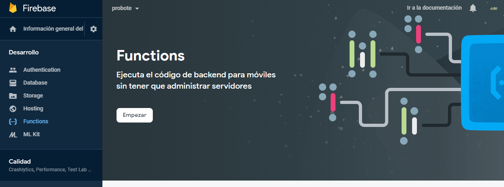
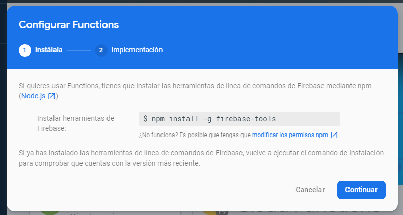
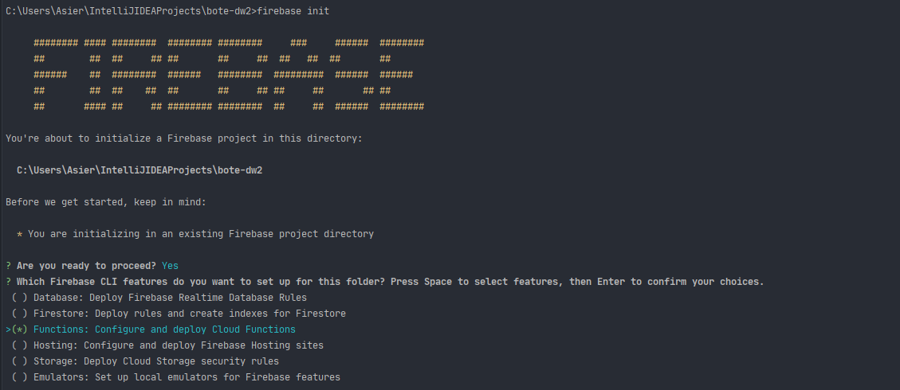
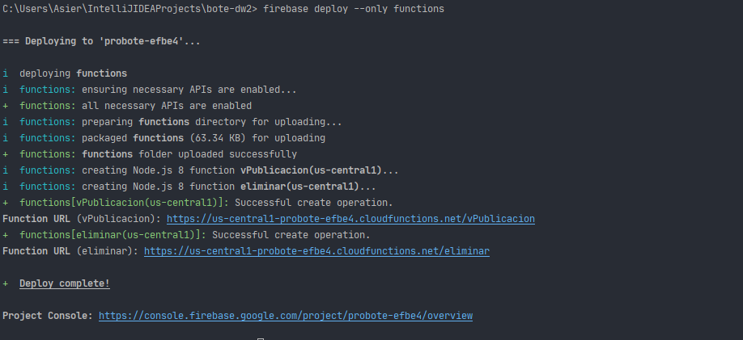
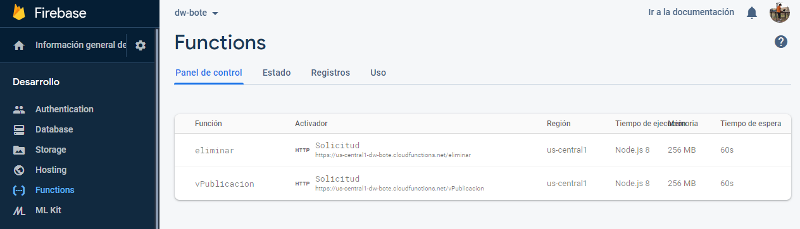

# Firebase 
## Functions

Firebase Functions permite ejecutar código en los
servidores de firebase con una llamada HTTP. Actualmente el proyecto dispone de dos [functions](#funciones-disponibles).

Para poder habilitar Firebase Functions accede a la consola
de Firebase


Sigue las instrucciones, necesitaras tener [Node.js](https://nodejs.org/en/) instalado en tu sistema y ejecutar el siguiente comando:
`npm install -g firebase-tools`



Situá la línea de comandos en la carpeta del proyecto y ejecuta los siguientes comandos:

Es posible que tengas que iniciar sesión con tu cuenta de google.


IMPORTANTE: Eliminar fichero [.firebaserc](/.firebaserc) para poder configurar el proyecto con un proyecto Firebase diferente

`firebase login` 

`firebase init` 

Usa las siguientes opciones durante el proceso de init. 



```
? Are you ready to proceed? Yes
? Which Firebase CLI features do you want to set up for this folder?  Functions: Configure and deploy Cloud Functions
? Please select an option: Use an existing project
? Select a default Firebase project for this directory: probote-efbe4 (probote)
? What language would you like to use to write Cloud Functions? JavaScript
? Do you want to use ESLint to catch probable bugs and enforce style? No
? File functions/package.json already exists. Overwrite? No
? File functions/index.js already exists. Overwrite? No
? File functions/.gitignore already exists. Overwrite? No
? Do you want to install dependencies with npm now? Yes
```

Despliega las funciones del proyecto:

` firebase deploy --only functions`




Tras el despliegue comprueba que se han creado las funciones desde la consola de Firebase



### Funciones disponibles

| Nombre | Acción | 
| --- | --- |
| eliminar | Elimina los viajes pendientes de borrar |
| vPublicacion | Función usada por CI/CD para consultar el siguiente numero de version para generar la version de producción de la APP |


## Hosting

Firebase permite hostear nuestro poryecto. Para ello ejectua los siguientes comandos (necesario configurar firebase):

Compila el sitio web:
```
ng build
? What do you want to use as your public directory? dist
? Configure as a single-page app (rewrite all urls to /index.html)? No
```

Inicializa `Hosting` en el proyecto local:

```
firebase init
? Are you ready to proceed? Yes
? Which Firebase CLI features do you want to set up for this folder? Hosting: Configure and deploy Firebase Hosting sites
? What do you want to use as your public directory? dist
? Configure as a single-page app (rewrite all urls to /index.html)? No
? File dist/index.html already exists. Overwrite? No
```
Despliega el sitio web, este comando devolverá la URL donde se encuentra el sitio hosteado.

```
firebase deploy --only hosting
```

