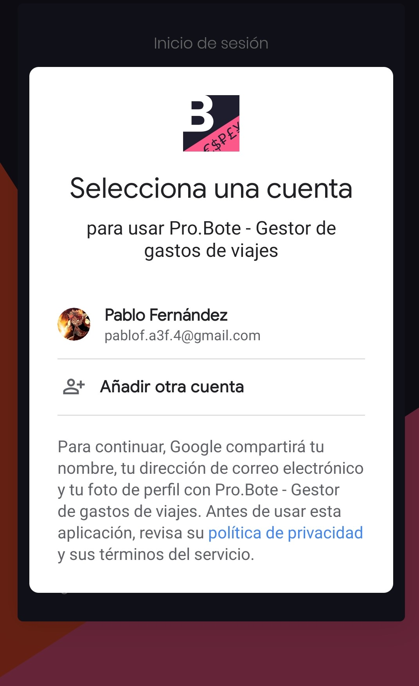
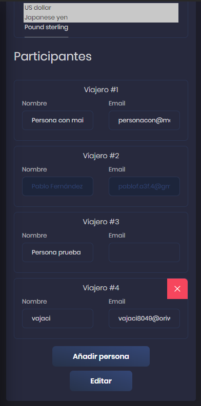
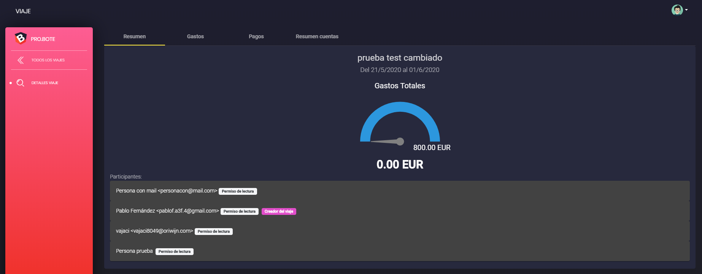

[[_TOC_]]

---

# Pruebas

Esta documentación describe pruebas internas efectuadas por los miembros del equipo de desarrollo. 

## Pruebas internas
### Prueba 1: Registro y login usuarios (user/pass)

| **Fecha** | 01/05/2020  | **Versión** | 0.2.62 |  **Autor** | ASIER |
| --- | --- | --- | --- | --- | --- |
| **SO** | Android | **Plataforma** | Web | **Estado** | Completada |

**Descripción del escenario inicial**:
Se valida que es posible crear un usuario desde el formulario de login

**Proceso**:
(1) Se verifica que el usuario no existe; (2) Se accede al formulario de registro y se procede al registro; (3) El sitio web solicita al usuario que se valide el correo;
(4) El usuario recibe un correo electrónico con un link; (5) La cuenta es validada gracias al link; (6) El usuario puede iniciar sesión y (7) sus datos son correctos.
 
**Resultado esperado**:
El usuario se registra y puede iniciar sesión.

**Resultado final**:
El usuario ha podido registrarse y ha podido iniciar sesión. Sus datos son correctos.

**Imágenes**

|  |  |  |  |  |  |  | 
| :---: | :---: | :---: | :---: | :---: | :---: | :---: |
| Pantalla de login | El login no existe | Pantalla de registro| Correo de verificación | Proceso verificación | Usuario iniciado | Perfil del usuario |

---

### Prueba 2: Login con Google Web

| **Fecha** | 02/05/2020  | **Versión** | 0.2.62 |  **Autor** | PABLO |
| --- | --- | --- | --- | --- | --- |
| **SO** | Windows | **Plataforma** | Web | **Estado** | Completada |

**Descripción del escenario inicial**:
Se valida que es posible iniciar sesión vía Google en la Web.

**Proceso**:
(1) Se hace click en el botón "LOG IN CON GOOGLE"; (2) Aparece una ventana emergente que gestiona el inicio de sesión de google; (3) El usuario inicia sesión usando su nombre y correo de google;
 
**Resultado esperado**:
Él puede iniciar sesión usando su cuenta de Google.

**Resultado final**:
El usuario ha iniciado sesión mediante Google Auth.

**Imágenes**

|  |  |  | 
| :---: | :---: | :---: | 
| Pantalla de login | Gestión de login de google | Inicio de sesión correcto | 

---

### Prueba 3: Login con Google Android

| **Fecha** | 02/05/2020  | **Versión** | 0.2.62 |  **Autor** | PABLO |
| --- | --- | --- | --- | --- | --- |
| **SO** | Android | **Plataforma** | App | **Estado** | Completada |

**Descripción del escenario inicial**:
Se valida que es posible iniciar sesión vía Google en la aplicación de Android.

**Proceso**:
(1) Se hace click en el botón "LOG IN CON GOOGLE"; (2) Aparece una ventana emergente que gestiona el inicio de sesión de google. Elegimos con que usuario de google queremos iniciar sesión; (3) El usuario inicia sesión usando su nombre y correo de google;
 
**Resultado esperado**:
Él puede iniciar sesión usando su cuenta de Google.

**Resultado final**:
El usuario ha iniciado sesión mediante Google Auth.

**Imágenes**

|  |  |  | 
| :---: | :---: | :---: | 
| Pantalla de login | Gestión de login de google | Inicio de sesión correcto | 

---

### Prueba 4: Logout funcional

| **Fecha** | 02/05/2020  | **Versión** | 0.2.62 |  **Autor** | PABLO |
| --- | --- | --- | --- | --- | --- |
| **SO** | Android | **Plataforma** | App | **Estado** | Completada |

**Descripción del escenario inicial**:
Se valida que es posible cerrar sesión una vez dentro de tu cuenta.

**Proceso**:
(1) Se hace click en el botón representado como tres puntos verticales; (2) Se hace click en el icono del perfil representado con una persona; (3) Se hace click en el botón "Log out"; (4) El usuario ha cerrado sesión satisfactoriamente.
 
**Resultado esperado**:
Él puede cerrar sesión.

**Resultado final**:
El usuario ha cerrado sesión.

**Imágenes**

|  |  |  |  | 
| :---: | :---: | :---: | :---: |
| Pantalla de la aplicación | Menu representado por tres puntos verticales | Botón de Log out | Log out correcto |

---

### Prueba 5: Crear un nuevo viaje

| **Fecha** | 02/05/2020  | **Versión** | 0.2.62 |  **Autor** | PABLO |
| --- | --- | --- | --- | --- | --- |
| **SO** | Windows | **Plataforma** | Web | **Estado** | Completada |

**Descripción del escenario inicial**:
Se valida que es posible crear un viaje.

**Proceso**:
(1) Se hace click en el botón "NUEVO VIAJE" situado en la barra lateral; (2) Se abre el formulario correspondiente al viaje; (3) Se rellena con la información del viaje necesaria y se hace click en el botón "CREAR"; (4) El usuario ha creado un viaje; (5) El viaje creado sale en la feed del usuario y de todos los participantes registrados que estén en el viaje.
 
**Resultado esperado**:
El usuario puede crear un viaje.

**Resultado final**:
El usuario ha creado un viaje.

**Imágenes**

|  |  |  |  |  | 
| :---: | :---: | :---: | :---: | :---: | 
| Pantalla de feed del usuario | Formulario de creación de viaje | Campos del formulario rellenos | Viaje creado correctamente | Feed del usuario |

---

### Prueba 6: Editar un viaje

| **Fecha** | 02/05/2020  | **Versión** | 0.2.62 |  **Autor** | PABLO |
| --- | --- | --- | --- | --- | --- |
| **SO** | Windows | **Plataforma** | Web | **Estado** | Completada |

**Descripción del escenario inicial**:
Se valida que es posible editar un viaje.

**Proceso**:
(1) Se hace click en el viaje que se quiera editar; (2) En el resumen del viaje se hace click en el botón "Editar viaje"; (3) Se abre el formulario de viaje con los datos en sus respectivos campos; (4) El usuario cambia los datos y le hace click al botón "Editar"; (5) El viaje se ha cambiado.
 
**Resultado esperado**:
El usuario puede editar un viaje.

**Resultado final**:
El usuario ha editado un viaje.

**Imágenes**

|  |  |  |  |  | 
| :---: | :---: | :---: | :---: | :---: | 
| Pantalla de feed del usuario | Resumen del viaje | Campos del formulario rellenos | Viaje editado | Resumen del viaje editado |

---

### Prueba 7: Borrar un viaje

| **Fecha** | 02/05/2020  | **Versión** | 0.2.62 |  **Autor** | PABLO |
| --- | --- | --- | --- | --- | --- |
| **SO** | Windows | **Plataforma** | Web | **Estado** | Completada |

**Descripción del escenario inicial**:
Se valida que es posible borrar un viaje.

**Proceso**:
(1) Se hace click en el viaje que se quiera borrar; (2) En el resumen del viaje se hace click en el botón "Editar viaje"; (3) Se abre el formulario de viaje con los datos en sus respectivos campos. En la parte inferior aparecen los botones para borrar/archivar el viaje. Se hace click en el botón "Borrar"; (4) Se pide confirmación del borrado; (5) El viaje pasa a pendiente de borrar hasta que se haga el borrado diario de viajes.
 
**Resultado esperado**:
El usuario puede borrar un viaje.

**Resultado final**:
El usuario ha borrado un viaje.

**Imágenes**

|  |  |  |  |  | 
| :---: | :---: | :---: | :---: | :---: | 
| Pantalla de feed del usuario | Resumen del viaje | Botón de borrado | Confirmación del borrado | Viaje en pendiente de borrar |

---

### Prueba 8: Archivar un viaje

| **Fecha** | 02/05/2020  | **Versión** | 0.2.62 |  **Autor** | PABLO |
| --- | --- | --- | --- | --- | --- |
| **SO** | Windows | **Plataforma** | Web | **Estado** | Completada |

**Descripción del escenario inicial**:
Se valida que es posible archivar un viaje.

**Proceso**:
(1) Se hace click en el viaje que se quiera archivar; (2) En el resumen del viaje se hace click en el botón "Editar viaje"; (3) Se abre el formulario de viaje con los datos en sus respectivos campos. En la parte inferior aparecen los botones para borrar/archivar el viaje. Se hace click en el botón "Archivar"; (4) Se pide confirmación del archivado; (5) El viaje pasa ha archivado.
 
**Resultado esperado**:
El usuario puede archivar un viaje.

**Resultado final**:
El usuario ha archivado un viaje.

**Imágenes**

|  |  |  |  |  | 
| :---: | :---: | :---: | :---: | :---: | 
| Pantalla de feed del usuario | Resumen del viaje | Botón de archivado | Confirmación del archivado | Viaje archivado |

---

### Prueba 9: Restaurar un viaje

| **Fecha** | 02/05/2020  | **Versión** | 0.2.62 |  **Autor** | PABLO |
| --- | --- | --- | --- | --- | --- |
| **SO** | Windows | **Plataforma** | Web | **Estado** | Completada |

**Descripción del escenario inicial**:
Se valida que es posible restaurar un viaje borrado/archivado.

**Proceso**:
(1) Se hace click en el viaje que se quiera restaurar; (2) En el resumen del viaje saldrá un mensaje avisando de que el viaje está pendiente de borrar/archivado. Hacemos click en "Cancelar" situado al final del mensaje; (3)(4) El viaje pasa a estar activo de nuevo.
 
**Resultado esperado**:
El usuario puede restaurar un viaje borrado/archivado.

**Resultado final**:
El usuario ha restaurado un viaje.

**Imágenes**

|  |  |  |  | 
| :---: | :---: | :---: | :---: |
| Feed del usuario. Viaje borrado | Resumen del viaje | Viaje restaurado | Feed del usuario. Viaje restaurado |

---

### Prueba 10: Añadir usuario existente un viaje ya creado

| **Fecha** | 02/05/2020  | **Versión** | 0.2.62 |  **Autor** | PABLO |
| --- | --- | --- | --- | --- | --- |
| **SO** | Android/Windows | **Plataforma** | Web | **Estado** | Completada |

**Descripción del escenario inicial**:
Se valida que es posible añadir un usuario existente en la BBDD a un viaje y que al mismo le salga en su propia feed.

**Proceso**:
(1) Se hace click en el viaje al que se quiera añadir una persona; (2) Hacemos click en "Editar viaje" para añadir la persona nueva; (3) Añadimos el nuevo participante usando el correo con el que se ha registrado; (4) Iniciamos sesión con ese usuario y observamos su feed. Entramos en el viaje; (5) Vemos que sale el viaje creado por el otro usuario.
 
**Resultado esperado**:
El usuario puede añadir un usuario existente y que salga en su feed.

**Resultado final**:
El usuario ha añadido a otro usuario existente satisfactoriamente.

**Imágenes**

|  |  |  |  |  | 
| :---: | :---: | :---: | :---: | :---: |
| Feed del usuario | Resumen del viaje | Añadir participante | Feed del segundo usuario | Resumen en el que se ve el viaje al que esta invitado |

---

### Prueba 11: Crear un nuevo gasto

| **Fecha** | MM/DD/AAAA  | **Versión** | 0.0.0 |  **Autor** | ASIER/PABLO |
| --- | --- | --- | --- | --- | --- |
| **SO** | Android/Windows | **Plataforma** | Web/App | **Estado** | Pendiente |

**Descripción del escenario inicial**:
Teniendo un viaje creado, añadir un gasto vinculado a dicho viaje.

**Proceso**:

**Resultado esperado**:
El gasto es creado y se ve reflejado en el resumen del viaje.

**Resultado final**:

**Imágenes**

|  |  |  |  |
| --- | --- | --- | --- |

---

### Prueba 12: Editar un gasto

| **Fecha** | MM/DD/AAAA  | **Versión** | 0.0.0 |  **Autor** | ASIER/PABLO |
| --- | --- | --- | --- | --- | --- |
| **SO** | Android/Windows | **Plataforma** | Web/App | **Estado** | Pendiente |

**Descripción del escenario inicial**:
Existe un viaje con uno o varios gastos previamente creados.

**Proceso**:

**Resultado esperado**:
El gasto es editado y los cambios se ven reflejados en el resumen del viaje.

**Resultado final**:

**Imágenes**

|  |  |  |  |
| --- | --- | --- | --- |

---

### Prueba 13: Borrar/Restaurar un gasto

| **Fecha** | MM/DD/AAAA  | **Versión** | 0.0.0 |  **Autor** | ASIER/PABLO |
| --- | --- | --- | --- | --- | --- |
| **SO** | Android/Windows | **Plataforma** | Web/App | **Estado** | Pendiente |

**Descripción del escenario inicial**:
Existe un viaje creado donde se disponen de uno o varios gastos.

**Proceso**:

**Resultado esperado**:
Los gastos pueden ser borrados, una vez borrados pueden ser restaurados correctamente.

**Resultado final**:

**Imágenes**

|  |  |  |  |
| --- | --- | --- | --- |

---

### Prueba 14: Crear un nuevo pago

| **Fecha** | MM/DD/AAAA  | **Versión** | 0.0.0 |  **Autor** | ASIER/PABLO |
| --- | --- | --- | --- | --- | --- |
| **SO** | Android/Windows | **Plataforma** | Web/App | **Estado** | Pendiente |

**Descripción del escenario inicial**:
Se dispone de un viaje con multiples participantes.

**Proceso**:

**Resultado esperado**:
Es posible crear un pago entre dos participantes y esté se ve reflejado en el resumen del viaje.

**Resultado final**:

**Imágenes**

|  |  |  |  |
| --- | --- | --- | --- |

---

### Prueba 15: Borrar un pago

| **Fecha** | MM/DD/AAAA  | **Versión** | 0.0.0 |  **Autor** | ASIER/PABLO |
| --- | --- | --- | --- | --- | --- |
| **SO** | Android/Windows | **Plataforma** | Web/App | **Estado** | Pendiente |

**Descripción del escenario inicial**:
Se dispone de un viaje con un pago.

**Proceso**:

**Resultado esperado**:
El pago puede ser borrado y aparece en el apartado de viajes borrados. El pago puede ser restaurado.

**Resultado final**:

**Imágenes**

|  |  |  |  |
| --- | --- | --- | --- |

---

### Prueba 16: Resumen de cuentas correcto

| **Fecha** | MM/DD/AAAA  | **Versión** | 0.0.0 |  **Autor** | ASIER/PABLO |
| --- | --- | --- | --- | --- | --- |
| **SO** | Android/Windows | **Plataforma** | Web/App | **Estado** | Pendiente |

**Descripción del escenario inicial**:
Se dispone de un viaje con multiples gastos y pagos.

**Proceso**:

**Resultado esperado**:
El resumen de cuentas pendientes entre participantes es correcto y se actualiza sin tener en cuenta gastos y pagos eliminados.

**Resultado final**:

**Imágenes**

|  |  |  |  |
| --- | --- | --- | --- |

---

### Prueba 17: Cambiar entre temas

| **Fecha** | MM/DD/AAAA  | **Versión** | 0.0.0 |  **Autor** | ASIER/PABLO |
| --- | --- | --- | --- | --- | --- |
| **SO** | Android/Windows | **Plataforma** | Web/App | **Estado** | Pendiente |

**Descripción del escenario inicial**:
Un usuario de la aplicación con sesión iniciada.

**Proceso**:

**Resultado esperado**:
El usuario puede alternar entre los dos temas disponibles (Claro/Oscuro). El cambio es valido solo para el navegador actual.

**Resultado final**:

**Imágenes**

|  |  |  |  |
| --- | --- | --- | --- |

---

### Prueba 18: Cambiar nombre de usuario

| **Fecha** | MM/DD/AAAA  | **Versión** | 0.0.0 |  **Autor** | ASIER/PABLO |
| --- | --- | --- | --- | --- | --- |
| **SO** | Android/Windows | **Plataforma** | Web/App | **Estado** | Pendiente |

**Descripción del escenario inicial**:
Un usuario de la aplicación con sesión iniciada.

**Proceso**:

**Resultado esperado**:
El usuario puede cambiar el nombre de su cuenta.

**Resultado final**:

**Imágenes**

|  |  |  |  |
| --- | --- | --- | --- |

---

### Prueba 19: Cambiar contraseña

| **Fecha** | MM/DD/AAAA  | **Versión** | 0.0.0 |  **Autor** | ASIER/PABLO |
| --- | --- | --- | --- | --- | --- |
| **SO** | Android/Windows | **Plataforma** | Web/App | **Estado** | Pendiente |

**Descripción del escenario inicial**:
Un usuario de la aplicación con sesión iniciada.

**Proceso**:

**Resultado esperado**:
El usuario puede solicitar y cambiar su contraseña.

**Resultado final**:

**Imágenes**

|  |  |  |  |
| --- | --- | --- | --- |

---

### Prueba 20: Presupuesto

| **Fecha** | MM/DD/AAAA  | **Versión** | 0.0.0 |  **Autor** | ASIER/PABLO |
| --- | --- | --- | --- | --- | --- |
| **SO** | Android/Windows | **Plataforma** | Web/App | **Estado** | Pendiente |

**Descripción del escenario inicial**:
Un viaje sin un presupuesto asignado con gastos.

**Proceso**:

**Resultado esperado**:
Es posible asignar un presupuesto a un viaje y el grafico de presupuesto es actualizado con los gastos no eliminados.

**Resultado final**:

**Imágenes**

|  |  |  |  |
| --- | --- | --- | --- |

---
