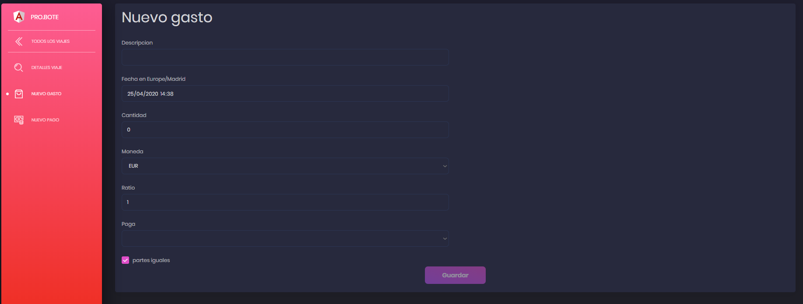
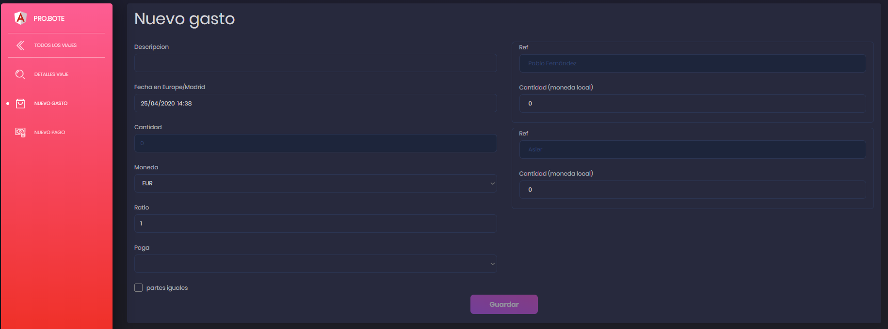
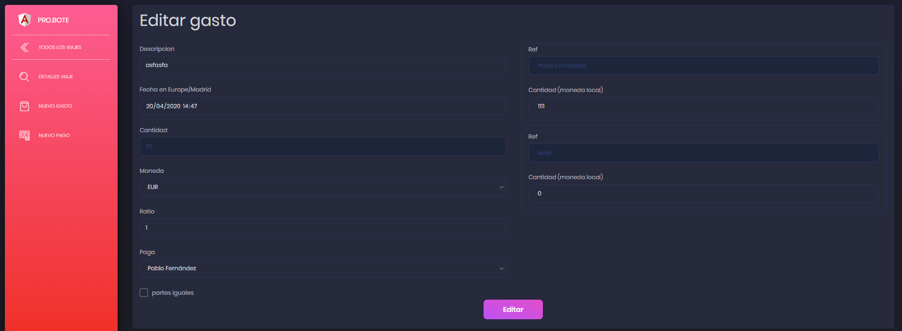

# GASTOS

Los gastos representan las compras realizadas en el viaje. Podemos hacer lo siguiente.

## Crear un gasto

Para empezar tendremos que crear un gasto mediante el botón "NUEVO GASTO" situado en el menu lateral en la pagina de un viaje. Para más información visitar [resumen.md](resumen.md)

Al hacer click en el botón aparecerá lo siguiente:

Todos los campos son bastante intuitivos asique no tendría que haber problemas a la hora de rellenarlos.

### Partes iguales

Abajo del todo hay un checker llamado partes iguales. Esto lo que hace es que divide la cantidad en partes iguales entre todos los participantes del viaje. Si le clickamos, se quitara el check y aparecera lo siguiente.

Como se puede ver, ahora salen los participantes, para que a cada uno se le asigne una cantidad diferente a cada uno.

## Editar un gasto

Al editar un gasto los campos del formulario se rellenaran con los datos del gasto y podrán ser modificados.

### Partes iguales

A la hora de editar un gasto, será posible cambiar entre partes iguales o cantidades fijas para cada participante.

---

[Inicio documentación](../README.md)
