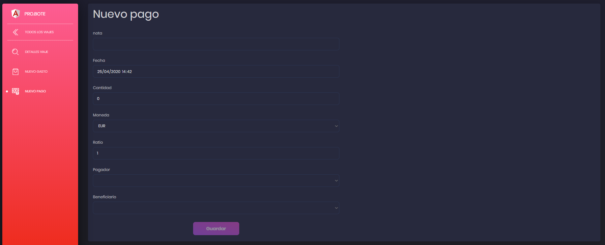

##PAGOS

Los pagos representan a las transacciones de dinero efectuadas entre los diferentes participantes de un viaje

##Crear un pago

Para empezar tendremos que crear un pago mediante el botón "NUEVO pago" situado en el menu lateral en la pagina de un viaje. Para más información visitar [resumen.md](resumen.md)

Al hacer click en el botón aparecerá lo siguiente:

El campo nota representa el concepto del pago.

El campo ratio representa el cambio de divisa respecto a la divisa principal del viaje.

Al acabar de rellenar los campos basta con hacer click en el botón "Guardar" para crear el pago.

---

[Inicio documentación](../README.md)
