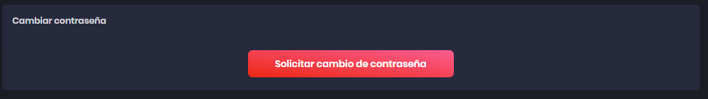
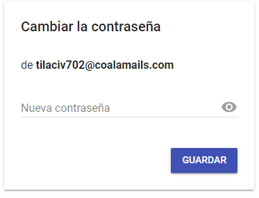
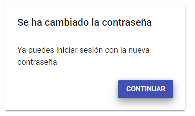

# Perfil

Empezaremos explicando las diferentes opciones que tiene uno en el perfil de usuario. Para entrar al perfil, hacemos click en la foto situada en la parte superior derecha y le daremos al botón correspondiente "Perfil".

## Editar perfil

Podremos editar el nombre con el que salgamos a la hora de gestionar los viajes. Para que los cambios se efectúen debemos presionar el botón "Guardar".

## Cambiar estilo de la página

Es posible poner la página en dos estilos de paletas de colores diferentes, a gusto del usuario. Para cambiar de paleta solo es necesario presionar el botón correspondiente en la sección "Tema".

## Cambio de contraseña

Es posible cambiar la contraseña de tu usuario. Para ello pulsa el botón "Solicitar cambio de contraseña" que se muestra en la imagen inferior

Se enviara un correo electrónico a su email con un enlace para cambiar la contraseña. Al hacer click un sitio web aparecerá. Rellene el campo con su nueva contraseña y pulse "GUARDAR".

Una vez cambiada, saldrá un mensaje comunicando el éxito del cambio de contraseña. Pulse "CONTINUAR" para volver.

Tenga en cuenta que su sesión se cerrará y tendrá que volver a iniciarla.

---

[Inicio documentación](../README.md)
