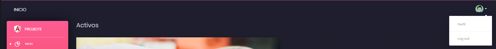
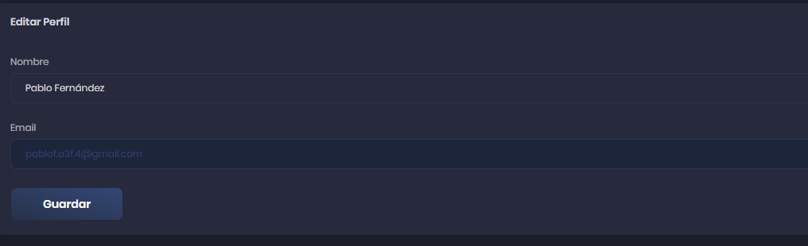

# Perfil

Empezaremos explicando las diferentes opciones que tiene uno en el perfil de usuario. Para entrar al perfil, hacemos click en la foto situada en la parte superior derecha y le daremos al botón correspondiente "Perfil".

## Editar perfil

Podremos editar el nombre con el que salgamos a la hora de gestionar los viajes. Para que los cambios se efectúen debemos presionar el botón "Guardar".

## Cambiar estilo de la página

Es posible poner la página en dos estilos de paletas de colores diferentes, a gusto del usuario. Para cambiar de paleta solo es necesario presionar el botón correspondiente en la sección "Tema".

---

[Inicio documentación](../README.md)
