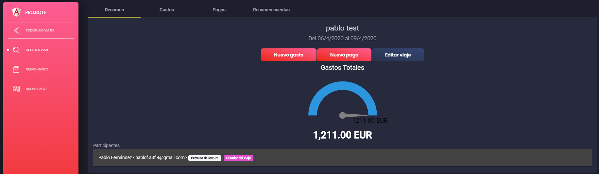
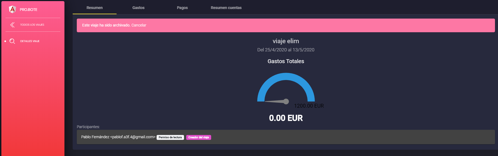
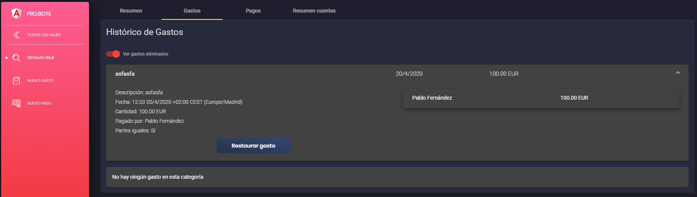
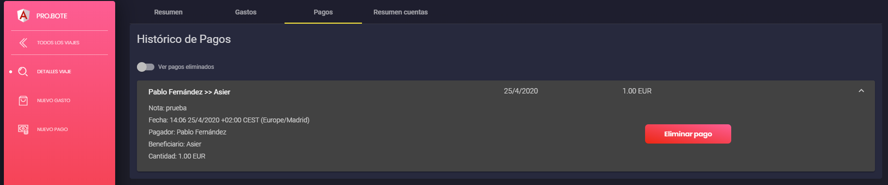
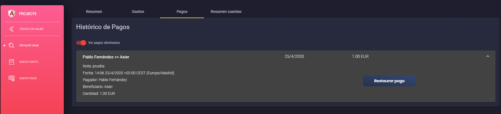
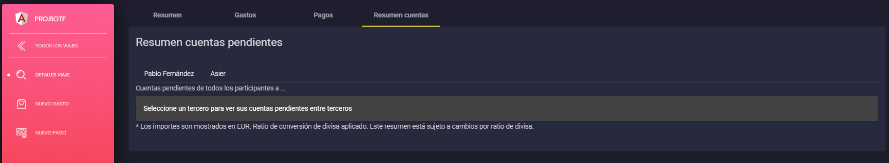
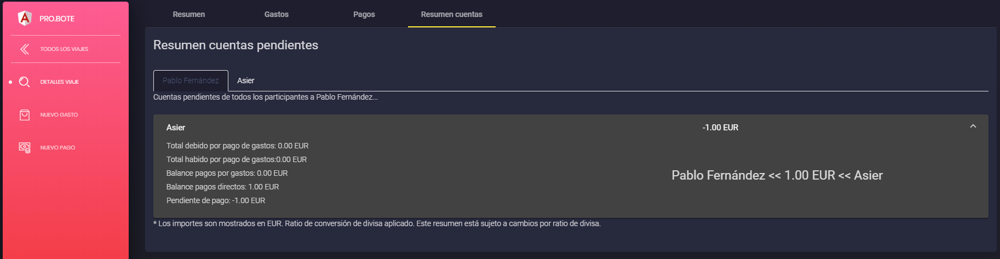

# INFORMACIÓN ACERCA DE UN VIAJE

Aquí veremos los diferentes apartados que componen la información total de un viaje.

## Resumen
Lo primero que nos encontramos en con la información general proporcionada al crear el viaje junto a un grafico que resume los gastos totales del mismo.

En este apartado disponemos de botones para 3 funcionalidades diferentes.

El primer botón nos permite crear un gasto. Para más información consultar [gastos.md](gastos.md)

El segundo botón nos permite crear un pago. Para más información consultar [pagos.md](pagos.md)

El tercer botón nos permite editar los datos del viaje. Para más información consultar [viajes.md](viajes.md)

Antes de seguir aclarar que crear un gasto y crear un pago están siempre disponibles usando del menú lateral, como se puede observar en la imagen superior.

### Viajes eliminados o archivados.

Si el viaje ha sido eliminado o archivado, aparecerá un mensaje en el resumen en el que te de la opción de volver el viaje a su estado de activo. Para esto solo haremos click en el boton Cancelar del mensaje de advertencia.

## Gastos

Aquí podremos ver los gastos ordenados en una lista. Si hacemos click en uno de los gastos podremos ver más detalles del mismo.

Si eres el creador del gasto te dara la opción de poder borrarlo. Al borrar un gasto, pasara a la lista de gastos eliminados del viaje.

Si accionamos el botón "Ver gastos eliminados" se podrán ver que gastos han sido eliminados del viaje. Al hacer click en un gasto eliminado, nos dara la posibilidad de restaurarlo para que vuelva a estar como activo. Para saber más a cerca de los gastos visita [gastos.md](gastos.md)

## Pagos

Aquí podremos ver los pagos ordenados en una lista. Si hacemos click en uno de los pagos podremos ver más detalles del mismo.

Si eres el creador del pago te dara la opción de poder borrarlo. Al borrar un pago, pasara a la lista de pagos eliminados del viaje.
 
 Si accionamos el botón "Ver pagos eliminados" se podrán ver que pagos han sido eliminados del viaje. Al hacer click en un pago eliminado, nos dara la posibilidad de restaurarlo para que vuelva a ser un pago activo. Para saber más a cerca de los pagos visita [pagos.md](pagos.md)

## Resumen cuentas

En este apartado podremos ver el resumen de las cuentas del viaje. Por cada participante del viaje habrá una lista con el dinero que debe o que le deben. Al entrar a la pestaña aparecerá lo siguiente

Basta con hacer click en uno de los nombres del participante para ver todas las cuentas que le quedan pendientes al mismo.

---

[Inicio documentación](../README.md)
