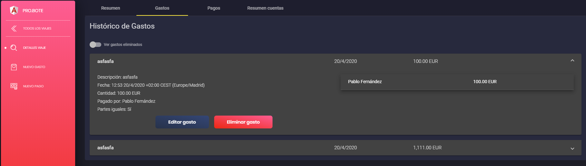

#INFORMACION ACERCA DE UN VIAJE

Aqui veremos los diferentes apartados que componen la informacion total de un viaje.

##Resumen
Lo primero que nos encontramos en con la informacion general proporcionada al crear el viaje junto a un grafico que reune los gastos totales del mismo.

En este apartado disponemos de botones para 3 funcionalidades diferentes.

El primer boton nos permite crear un gasto. Para mas informacion consultar [gastos.md](gastos.md)

El segundo boton nos permite crear un pago. Para mas informacion consultar [pagos.md](pagos.md)

El tercer boton nos permite editar los datos del viaje. Para mas informacion consultar [viajes.md](viajes.md)

Antes de seguir aclarar que crear un gasto y crear un pago estan siempre disponibles a traves del venu lateral, como se puede observar en la imagen superior.

###Viajes eliminados o archivados.

Si el viaje ha sido eliminado o archivado, aparecera un mensaje en el resumen en el que te de la opcion de volver el viaje a su estado de activo. Para esto solo haremos click en el boton Cancelar del mensaje de advertencia.

##Gastos

Aqui podremos ver los gastos ordenados en una lista. Si hacemos click en uno de los gasots podremos ver mas detalles del mismo.

Si eres el creador del gasto te dara la opcion de poder borrarlo. Al borrar un gasto, pasara a la lista de gastos eliminados del viaje.

Si accionamos el boton "Ver gastos eliminados" se podran ver que gastos han sido eliminados del viaje. Al hacer click en un gasto eliminado, nos dara la posibilidad de restaurarlo para que vuelva a estar como activo. Para saber mas a cerca de los gastos visita [gastos.md](gastos.md)

##Pagos

Aqui podremos ver los pagos ordenados en una lista. Si hacemos click en uno de los pagos podremos ver mas detalles del mismo.

Si eres el creador del pago te dara la opcion de poder borrarlo. Al borrar un pago, pasara a la lista de pagos eliminados del viaje.
 
 Si accionamos el boton "Ver pagos eliminados" se podran ver que pagos han sido eliminados del viaje. Al hacer click en un pago eliminado, nos dara la posibilidad de restaurarlo para que vuelva a ser un pago activo. Para saber mas a cerca de los pagos visita [pagos.md](pagos.md)

##Resumen cuentas

En este apartado podremos ver el resumen de las cuentas del viaje. Por cada participante del viaje habra una lista con el dinero que debe o que le deben. Al entrar a la pestaña aparecera lo siguiente

Basta con clickar en uno de los nombre del participante para ver todas las cuentas que le quedan pendientes al mismo.

[Inicio documentación](../README.md)
