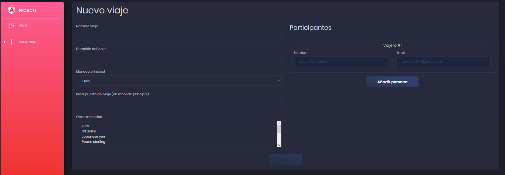
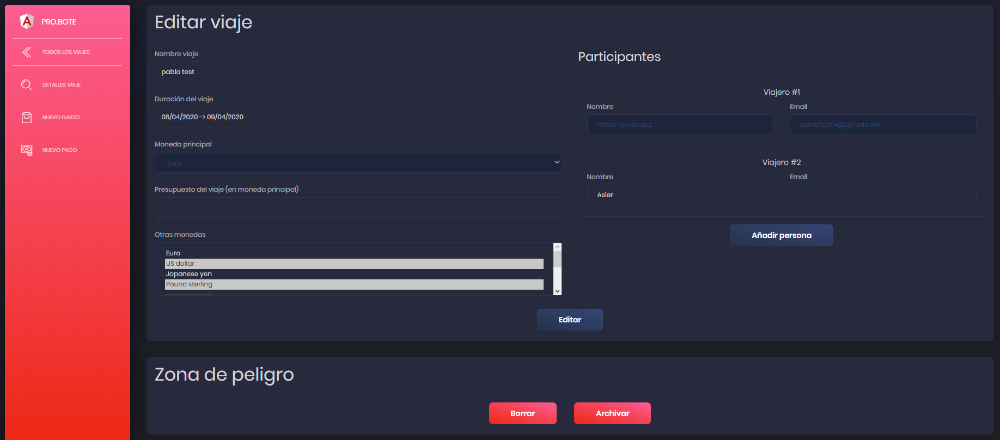

# VIAJES

Los viajes son el elemento principal de este aplicativo. Podremos hacer lo siguiente con un viaje.

## Crear un viaje

Para empezar tendremos que crear un viaje mediante el botón "NUEVO VIAJE" situado en el menu lateral en la pagina de inicio. Para más información visitar [inicio.md](inicio.md)

Al hacer click en el botón aparecerá lo siguiente:

Duración del viaje es un campo en el cual podremos elegir un rango de fechas.

El campo otras monedas es un campo en el que se puede elegir más de una moneda.

Después de rellenar los campos basta con hacer click en el botón "Crear" para crear el viaje.

### Participantes

A la hora de añadir un participante al viaje es posible añadir gente que no este registrada en el aplicativo. Para añadir a alguien registrado el correo debera coincidir con el correo introducido por el usuario a la hora de iniciar sesión. De esta forma este viaje aparecerá en su página de inicio.

## Editar un viaje

Al editar un viaje los campos del formulario se rellenaran con los datos del viaje y podrán ser modificados. Ten en cuenta que algunos de los campos como la moneda principal o el creador del viaje no podrán ser modificados.

### Participantes

A la hora de editar un viaje, será posible cambiar los datos de los participantes que ya estaban en el viaje pero no se podrán eliminar. También será posible la inserción de nuevos participantes.

### Zona de peligro

A la hora de editar un viaje, nos dara la oportunidad de borrar o archivar el viaje. 

Si borramos el viaje el mismo pasara al estado pendiente de borrado, hasta el momento en el que sea borrado. Una vez borrado el viaje no podrá recuperarse. Los viajes son borrados todos los días a las 00:00 (Hora Europe/Madrid) asique si quiere recuperarlo tenga este dato en cuenta. Para saber más de como recuperar un viaje eliminado visita  [resumen.md](resumen.md)

Si archivamos el viaje, el mismo pasara al estado archivado. Al estar archivado el viaje no podrá ser modificado, es decir se dara el viaje como finalizado. Para saber más de como des archivar un viaje visita [resumen.md](resumen.md)

---

[Inicio documentación](../README.md)
